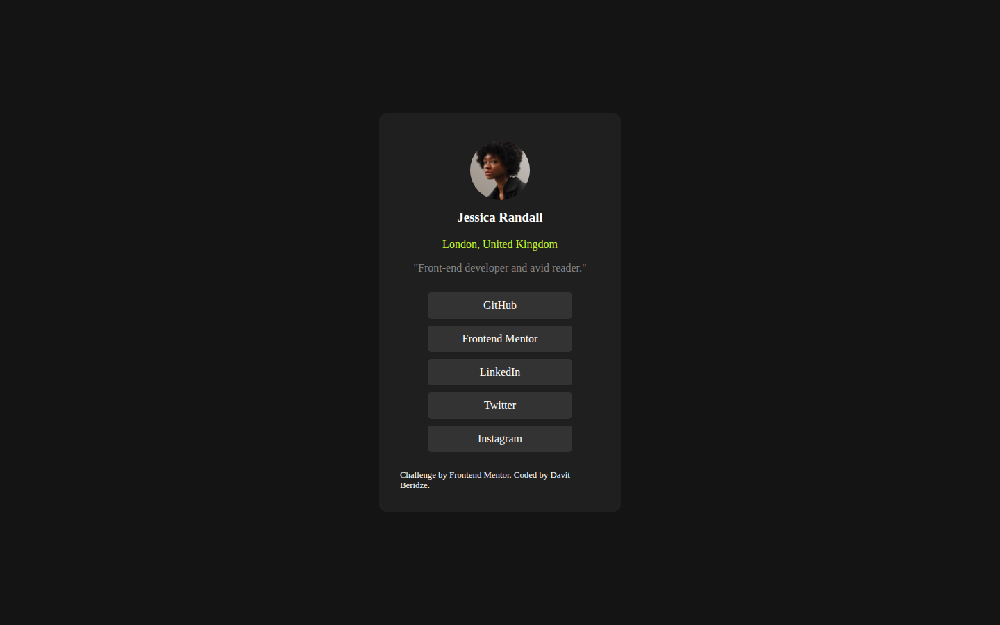
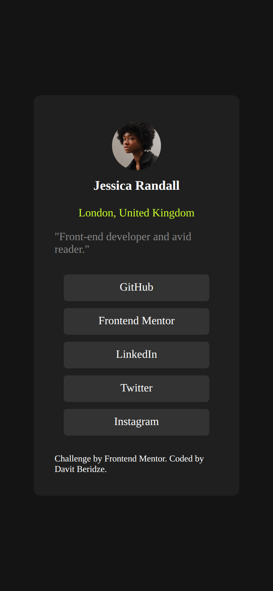

# Social Links Profile

My solution to the [Social links profile](https://www.frontendmentor.io/challenges/social-links-profile-UG32l9m6dQ) challenge on Frontend Mentor. A link-in-bio style profile card with buttons for each social network.





## Features

- Avatar, name, location, and short bio
- Five social link buttons
- Responsive card width

## Built with

- Semantic HTML
- CSS with Flexbox and media queries

## Run locally

No build step or dependencies. Open `index.html` in a browser, or serve the folder:

```bash
npx serve .
```
